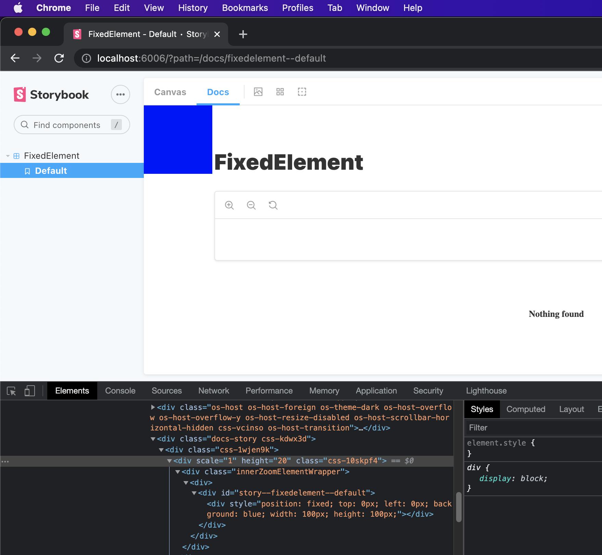
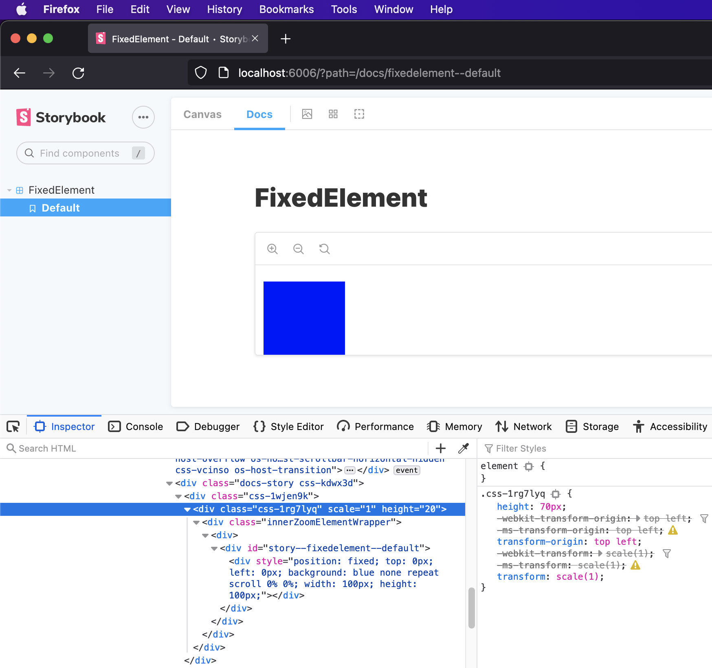
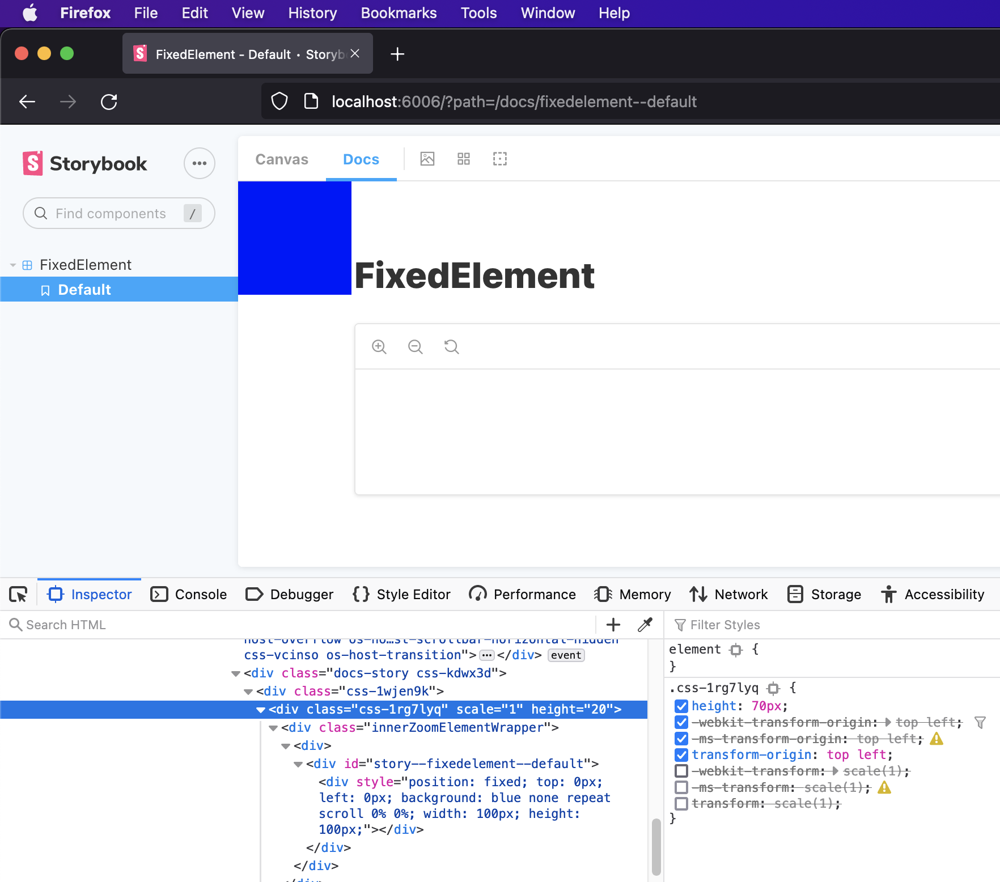

# bug-storybook-firefox-position-fixed
To view the issue, open the story in Docs view in both Firefox and another browser.

**Chrome** ✅

**Firefox** ❌

**Firefox (with the transform style disabled)** ✅

## Bug Description:
In Firefox, the zoom feature uses `transform` styles (see [12845](https://github.com/storybookjs/storybook/pull/12845)) - unfortunately this breaks positioning on elements that require `position: fixed` when in the "Docs" view.

Normally a `position: fixed` element's position would correspond to the window but in Firefox it corresponds to the element with the `transform` style. This is confirmed by disabling this style in the Firefox dev tools.

The issue is present regardless of actually using the zoom feature. I have tried to disable the zoom feature (see [16771](https://github.com/storybookjs/storybook/issues/16771)) in the hopes that it might also remove the styling used for zoom, however, the styling remains.
